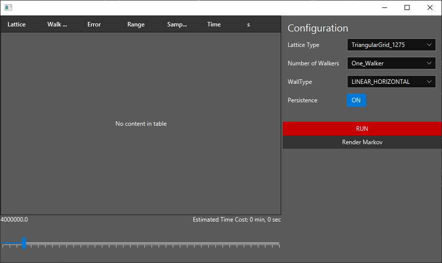

# GraphWalker

Monte Carlo simulation for approximationg random walk realizations of a stochastic process on various types of atomic lattices. Used to confirm the probabilistic characteristics of the exact analytically computed results.

### Publications
* https://arxiv.org/pdf/1901.10226 (Physical Review E)
* https://arxiv.org/pdf/1711.00955 (Physica A: Statistical Mechanics and its Applications)
